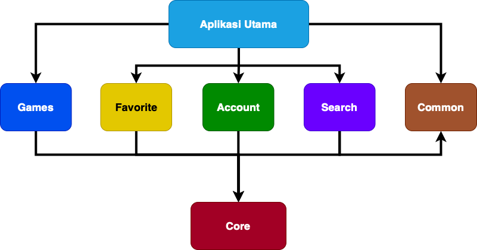

Games Catalogue
=================
[](https://github.com/Centauryal/Game-Catalogue/actions/workflows/swift.yml)

[](https://developer.apple.com/swift)

Game catalog app describing best practices for developing iOS with Swift. This repository contains detailed application examples implementing Clean Architecture with the VIPER pattern using UIKit, Modularization, Custom Built Core Libraries, Alamofire, SDWebImage, SwiftLint, Localization, CoreData and Manual Injection. Classes have been designed in such a way that they are inheritable and maximize code reuse.

Getting Started
---------------
This is the big picture, which should look familiar if you have been using Clean Architecture in your iOS Applications.


The general principle is to use a basic 3 tiers architecture. The good thing about it, is that it is very easy to understand and many people are familiar with it. So we will break down our solution into layers in order to respect the dependency rule (where dependencies flow in one direction: check above the rounded clean architecture graph):


VIPER is an application of Clean Architecture to iOS apps. The word VIPER is a backronym for View, Interactor, Presenter, Entity, and Routing. Clean Architecture divides an app’s logical structure into distinct layers of responsibility. This makes it easier to isolate dependencies (e.g. your database) and to test the interactions at the boundaries between layers:


The approach to modularization simply breaks down modules based on features where each model will be part of the module.



### RAWG.IO API key
Games Catalogue uses [RAWG.IO API](https://rawg.io/apidocs) to load a catalog of games available on the screen.

Once you have the key, add this line to the `GamesCatalogue-Info` file, either in the project's gamescatalogue/Supporting Files folder:

```
API_KEY = <YourRAWG.IO access key>
```

Screenshots
-----------
<br>
<p text-align="center">
  
  
  
</p>
<br>
<p text-align="center">
  
  
  
</p>
<br>

Libraries Used
--------------
* [UIKit][0] - It provides the window and view architecture for implementing your interface.
* [CoreData][1] - Use Core Data to save your application’s permanent data for offline use, to cache temporary data, and to add undo functionality to your app on a single device.
* [Alamofire][2] - Elegant HTTP Networking in Swift.
* [SDWebImage][3] - Asynchronous image downloader with cache support as a UIImageView category.
* [SwiftLint][4] - A tool to enforce Swift style and conventions, loosely based on the now archived GitHub Swift Style Guide.
* [Core][5] - Custom built libraries for modularization.
* [Manual Injection][6] - Dependency injection means giving an object its instance variables.
* [SkeletonView][7] - An elegant way to show users that something is happening and also prepare them to which contents they are awaiting.

[0]: https://developer.apple.com/documentation/uikit
[1]: https://developer.apple.com/documentation/coredata
[2]: https://github.com/Alamofire/Alamofire
[3]: https://github.com/SDWebImage/SDWebImage
[4]: https://github.com/realm/SwiftLint
[5]: https://github.com/Centauryal/Core-GamesCatalogue
[6]: https://www.dicoding.com/academies/209/tutorials/11537
[7]: https://github.com/Juanpe/SkeletonView

Additional resources
--------------------
Check out these pages to learn more about Clean Architecture:
- [Clean Architecture by Robert C. Martin (Uncle Bob)](https://blog.cleancoder.com/uncle-bob/2012/08/13/the-clean-architecture.html)

Noted
--------------------
Please use this as a reference only. Hope this helps you develop more projects.

License
--------------------
```
Copyright (C) 2021 Alfa Centaury Hidayatullah

   Licensed under the Apache License, Version 2.0 (the "License");
   you may not use this file except in compliance with the License.
   You may obtain a copy of the License at

       http://www.apache.org/licenses/LICENSE-2.0

   Unless required by applicable law or agreed to in writing, software
   distributed under the License is distributed on an "AS IS" BASIS,
   WITHOUT WARRANTIES OR CONDITIONS OF ANY KIND, either express or implied.
   See the License for the specific language governing permissions and
   limitations under the License.
```

